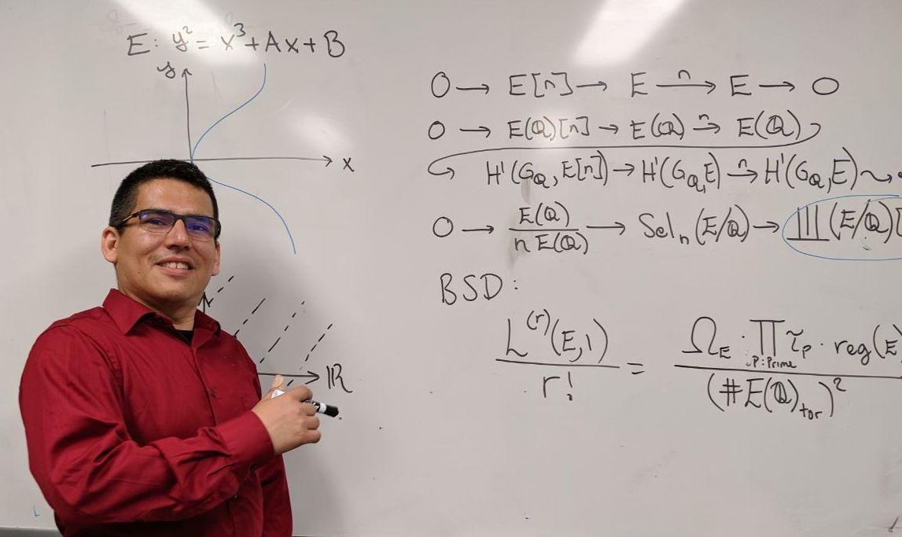

# GEZE

The content of this website is the following:



## 1. Summaries 
I will either list links to 
__summaries__ of classes that I have taught,
or of book chapters that I have read,
or summaries of my daily lessons.

<--->
## 2. Tutorials.
I will post either __tutorials__ in my own notation,
**links** to __guides__ and self adjustments,
and **links** to __Cheat Sheets__ for either video games or software or any kind.

<--->
## 3. My Family. 



## Who I am?
I am a Salvadorean who went from being a _Parking Attendant_
in Universal Studios, Los Angeles,
to be a (currently unemployed) _Mathematics Ph.D._,
in only 12 years.
I am an ex-Perico, ex-Bruin, ex-Matador, ex-Husky 
who needs to learn fast to
get a job, and reunite with my American redhead wife,
and our two kids. 

## My first lesson
In order to see a live-preview of this page
while I edit it, is 
    
    hugo server --minify --theme book

1. The command `hugo` manages the website. 
2. The command `serve` will host a server in your computer
3. The option `--minify` makes the output html code shorter.
4. The option `--theme book` is the theme choice of this website.
5. Open http://localhost:1313/ in your browser. 
6. See [here](https://github.com/alex-shpak/hugo-book#configuration) for
   configuration for this particular theme: **book**

The list of links that will appear 
in the right menu are the sections of 
this main page, which is located in:

    /path_to_website/content/_index.md

The list of links of the left menu
are documents listed in:

    /path_to_website/content/docs

